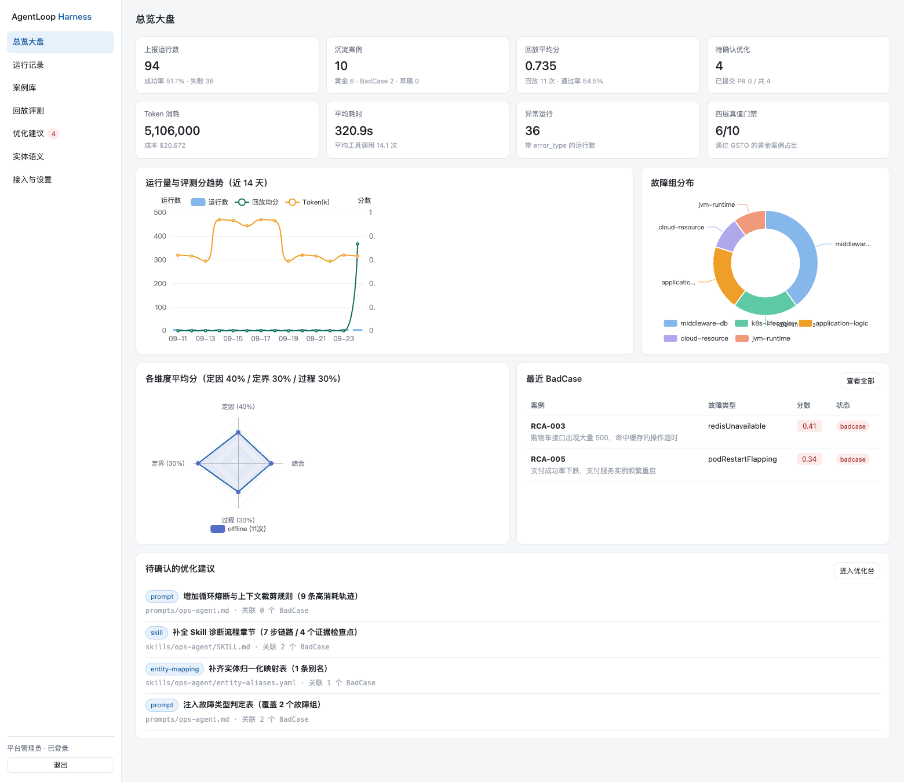
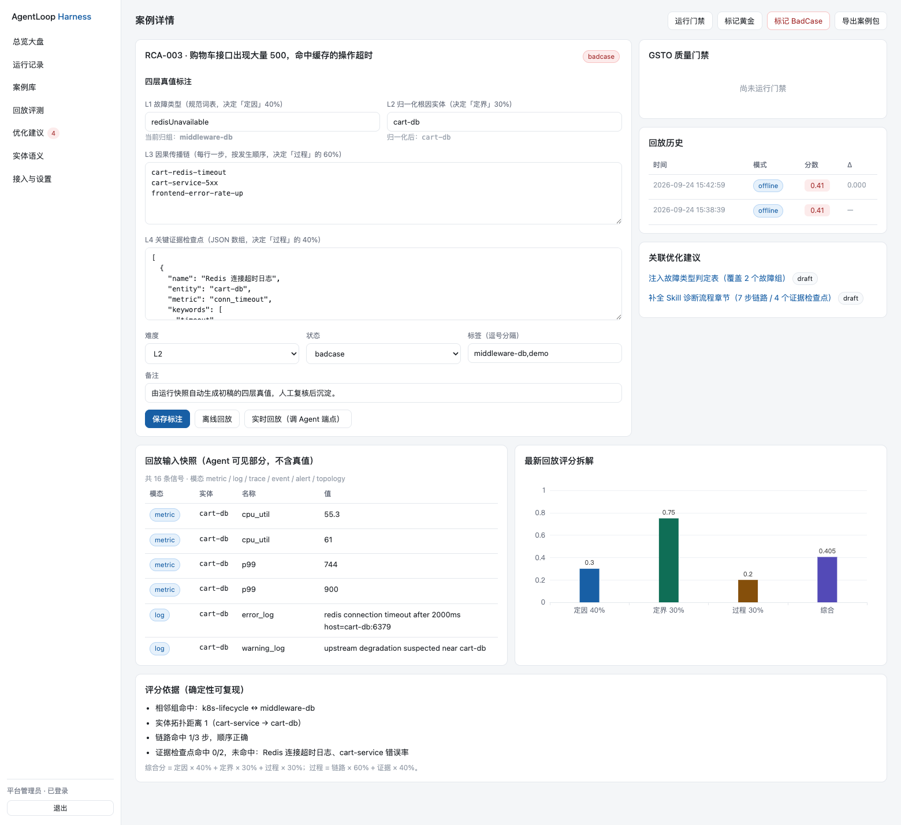
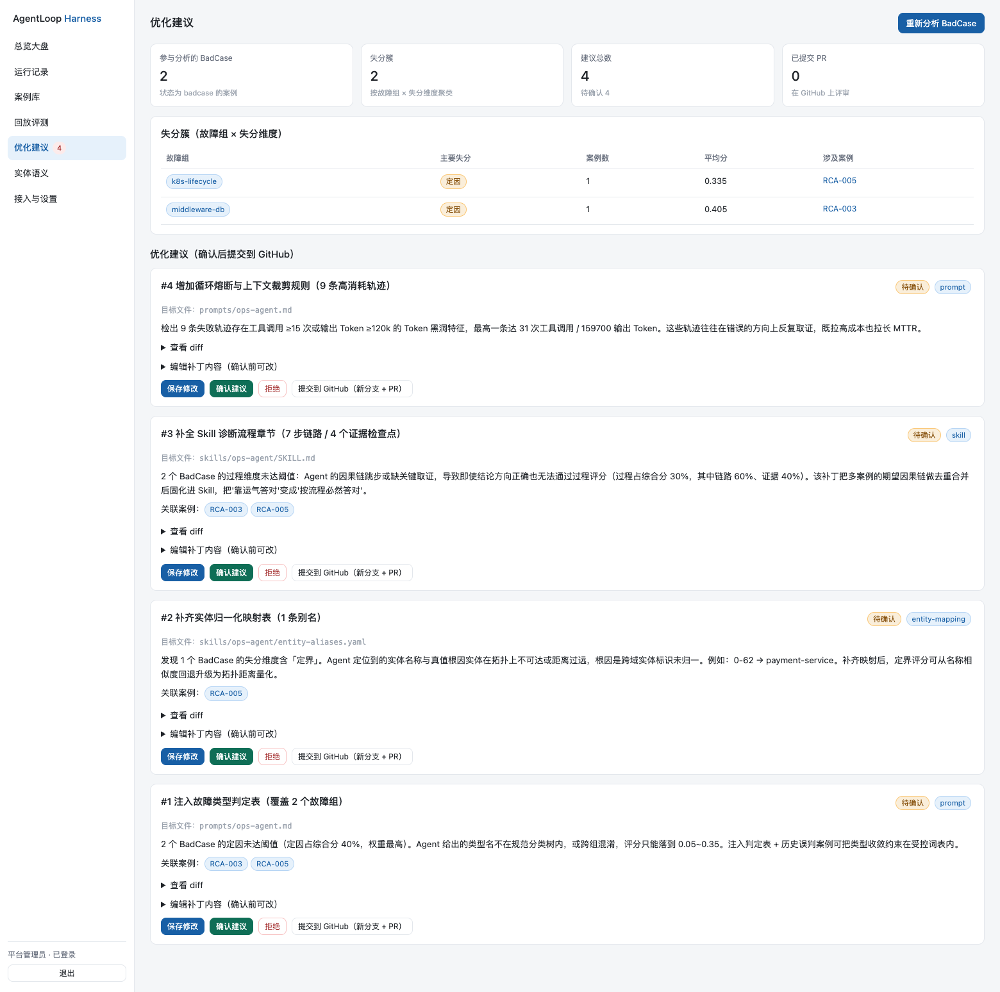
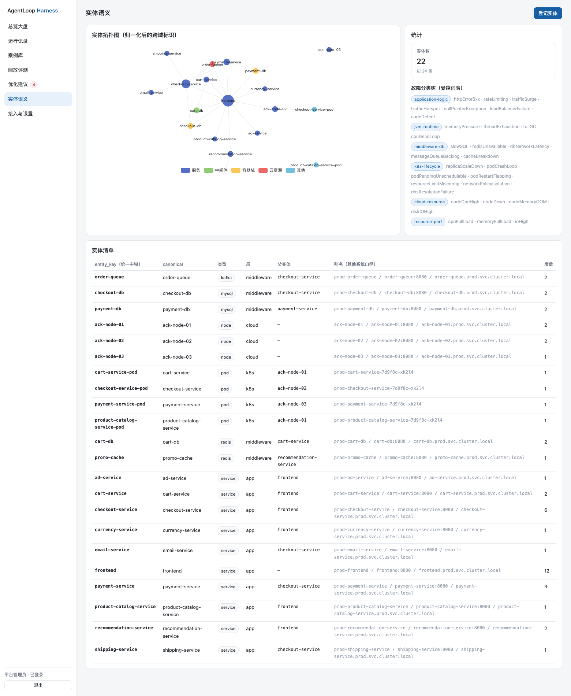
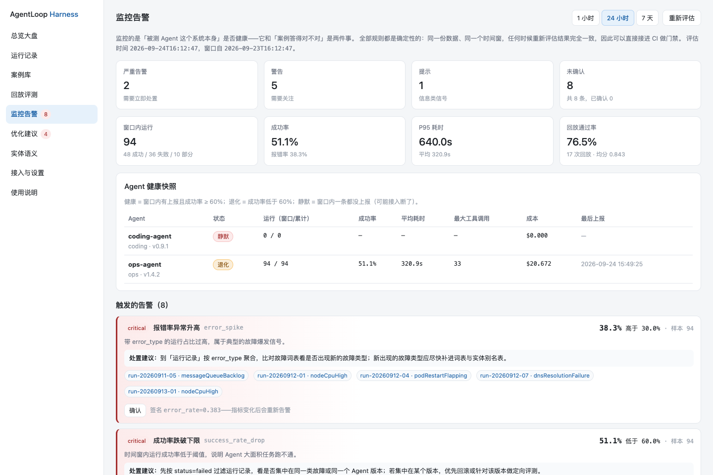
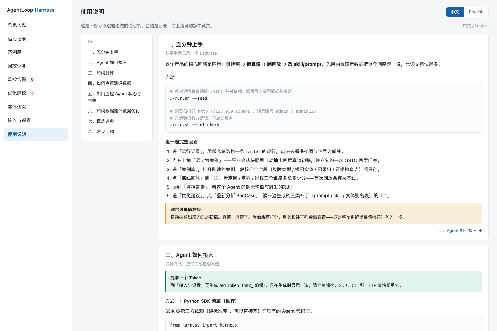

# AgentLoop Harness

> 面向 AgenticOps 的**故障复盘与回归评测平台**：把线上真实故障的 trace / metrics / logs 快照录下来 → 标注四层真值 → 变成可回放、可复跑的 Case → 自动识别 BadCase 并生成 skill / prompt 修改建议 → 确认后一键提 PR 发布新版本。

灵感来自阿里云栖大会《面向 AgenticOps 的开源建设》中提到的 **三道墙**：采不到、读不懂、验不准。
本项目聚焦第三道墙——**验不准**，把开源生态里的观测采集能力（OTel / OBI 风格）与 RCA Benchmark 的**四层结构化真值**拼成一个能落地的工程闭环。

```
┌──────────────┐  trace/metrics/logs   ┌────────────────────────────────────────┐
│  线上 Agent   │ ───── 快照上报 ─────▶ │            Harness 平台                 │
│ (任意框架)     │                       │                                        │
└──────────────┘                       │  ① 快照仓  runs / spans / signals       │
      ▲                                │  ② 实体图  entities + 拓扑              │
      │                                │  ③ 案例库  cases（三层状态机）           │
      │  live 回放（HTTP）              │  ④ 打分器  确定性四维加权               │
      └────────────────────────────────│  ⑤ 优化器  规则引擎 → diff 补丁         │
                                       │  ⑥ 发布器  GitHub 新分支 + PR           │
                                       └────────────────────────────────────────┘
```

## 为什么是"确定性打分"

大模型当裁判（LLM-as-a-Judge）不可复现、不可审计、成本高，**不适合做回归门禁**。
本平台把评分做成**纯确定性算法**（零网络、零模型调用），同一份作答永远得同一个分，并且在每次评分结果里返回 `deterministic_ratio`，明确告诉你哪一部分是硬规则算出来的。

四个维度，权重固定：

| 维度 | 权重 | 衡量什么 | 判定方式 |
|---|---|---|---|
| 定因 fault | **40%** | 故障类型判断对不对 | 精确匹配 1.0；同族 0.6；相邻族 0.3；隔两族 0.12；未命中 0.05 |
| 定界 entity | **30%** | 根因实体定位准不准 | 归一化后精确 1.0；命中拓扑则按跳数衰减 0.25/跳；不连通退化为字符串相似度（≤0.45） |
| 过程 process | **30%** | 因果链 + 证据检查点 | `因果链 LCS 覆盖率×0.6 + 证据命中率×0.4`（顺序错乱再打 0.7 折） |

判定阈值：`≥0.75 通过（pass）`、`≥0.5 部分正确（partial）`、`<0.5 失败（fail）`。

## 快速开始

```bash
# 1) 一键启动（首次会自动建 venv 装依赖），并写入演示数据
./run.sh --seed

# 2) 浏览器打开
open http://127.0.0.1:8848
#    演示账号：admin / admin123
```

不想装依赖、只想验证打分逻辑？

```bash
./run.sh --selfcheck     # 61 项离线断言，不启动服务
```

### 常驻运行（崩溃自动重启 + 公网隧道）

`./run.sh` 是前台进程，终端一关就停。要长期挂着用：

```bash
scripts/daemonctl.sh start    # server + cloudflared 隧道，双 fork 守护 + 崩溃 5s 自动重启
scripts/daemonctl.sh status   # 状态 + 当前公网地址（也写在 data/public_url.txt）
scripts/daemonctl.sh stop     # 全部停止
```

隧道用 Cloudflare Quick Tunnel（免账号），**每次重启会换域名**，以 `data/public_url.txt` 为准。
要开机自启（重启电脑后也拉起），用 `scripts/launchd/` 里的模板，见其 README——与 daemonctl 二选一，别同时跑。


### 界面一览

**总览大盘** —— 运行量与评分趋势、故障分布、三维雷达、最近 BadCase、待确认优化建议：



**案例详情** —— 四层真值标注（每层都标了权重）、GSTO 门禁、回放历史与 Δ、评分依据逐条可复算：



**优化建议** —— BadCase 聚类 + 带统一 diff 的可评审补丁，确认后一键提 PR：



**实体语义** —— 归一化实体拓扑（力导向图）、跨域命名口径对照、故障分类树：



**监控告警** —— 被测 Agent 的健康快照（健康 / 退化 / 静默）+ 10 条确定性规则 + 可编辑阈值：



**使用说明** —— 内置中英双语说明书，覆盖接入 / 测评 / 看数 / 监控 / 优化全流程：



### 接一个自己的 Agent

```bash
# 网页「设置 → API Token」生成一个 hnx_ 开头的 Token，然后：
export HARNESS_ENDPOINT=http://127.0.0.1:8848
export HARNESS_TOKEN=hnx_xxxxxxxxxxxx

pip install -e sdk                      # 安装本地上报 SDK（零第三方依赖）

# 把一次故障排查全过程录下来并上报
python3 examples/sdk_demo.py

# 或者：把本地已有的 trace/metrics/logs 文件直接导进去
harness snapshot --dir examples/snapshot --task "checkout P99 飙升" --error-type slowSQL

# 或者：包裹式录制任意子进程
harness record --task "跑一遍诊断脚本" -- python3 my_agent.py
```

## 六步闭环

### ① 录制快照 —— 采得到

三种上报方式，覆盖不同接入成本：

| 方式 | 适用场景 | 命令 / 接口 |
|---|---|---|
| SDK 包裹 | 自己的 Agent 代码可控 | `with h.run(task=...) as rec: rec.metric(...)` |
| 目录导入 | 已有落盘的 trace/metrics/logs | `harness snapshot --dir ./snapshots` |
| HTTP 直传 | 任意语言 / 任意框架 | `POST /api/v1/ingest/run`（Bearer 或 `X-Api-Token`） |

信号统一为 7 种模态：`metric / log / trace / event / alert / topology / span`。

### ② 实体归一 —— 读得懂

线上实体名五花八门，`prod-cart-service-5f7c9d-x2k4`、`cart_service:8080`、`PROD/cart-service` 必须是同一个东西。平台内置归一化管道：

```
去环境前缀(prod-/staging-) → 去 Pod 哈希后缀 → 去端口 → 取路径末段 → 转小写 → 连字符连接
```

三者都会归一成 `cart-service`，让拓扑图不碎片化、让定界打分不被命名差异污染。

### ③ 标注四层真值 —— 验得准

从一条运行快照可以一键生成案例，**四层真值自动抽初稿**（`ingest.auto_fill_from_run`），人工复核后落库：

```
L1 故障类型   fault_type          →  规范到 6 大族的受控词表
L2 根因实体   root_cause_entity   →  归一化实体键
L3 因果链     causal_chain        →  有序步骤
L4 证据检查点 evidence            →  每条含关键词 / 实体 / 指标，支持三种命中规则
```

创建案例时立刻跑 **GSTO 四层质量门禁**（Structure / Signal / TimeWindow / Openness），不合格的案例不允许进入黄金集——避免"垃圾真值污染榜单"。

详见 [`docs/GROUND-TRUTH.md`](docs/GROUND-TRUTH.md)。

### ④ 回放复跑 —— 可回归

三种回放模式：

- **offline**：用快照中记录的作答重跑打分链路。零外部依赖，用来建基线和验证打分器。
- **live**：把案例的可观测摘要 POST 给你配置的 Agent 地址（见 `examples/local_agent.py`），真实调用被测 Agent。
- **snapshot**：用当前快照重算，验证真值修改后的分数变化。

回放会自动做三件事：写入 `case_runs` 历史、对比基线算 `delta`、按结果**自动流转案例状态**（fail → BadCase，pass → 黄金）。

### ⑤ BadCase 分析 → 生成修改建议

优化器是**确定性规则引擎**（不烧 token），对 BadCase 聚类后自动产出可评审的补丁：

| 规则 | 触发条件 | 产出 |
|---|---|---|
| 定因纠偏 | BadCase 的故障类型判断错误 | 往 `prompts/<agent>.md` 注入**故障类型判定表** |
| 实体映射 | 定界失分集中在同族实体 | 生成 `skills/<agent>/entity-aliases.yaml` 别名表 |
| 诊断流程 | 因果链 / 证据持续失分 | 往 `skills/<agent>/SKILL.md` 追加**诊断流程章节**（因果链顺序 + 证据检查点 + 结论 JSON 契约） |
| 效率治理 | ≥3 次运行 tool_calls ≥15 或 tokens_out ≥120k | 注入防打转 / 上下文裁剪规则 |

每条建议都带着 `difflib.unified_diff` 生成的**统一 diff**，在网页上可视化 review。

### ⑥ 确认后发布 —— 一键提 PR

网页上点「确认」→ 平台调用 GitHub API：

```
建分支  harness/opt-<建议ID>-<时间戳>   （从你配置的 base 分支拉出）
提交    ① 目标文件的新内容（skill / prompt / 别名表）
        ② harness/optimizations/<slug>.md   建议说明 + diff + 关联案例
        ③ harness/cases/<case_key>.json     该案例的冻结快照
开 PR   → 你审核合并即"发布新版本"
```

**任何写操作都必须人工确认**，平台不会自动 push。

## 功能地图

| 页面 | 能力 |
|---|---|
| 总览 | KPI（运行数 / 通过率 / 黄金数 / BadCase 数）、通过率趋势、故障分布、维度雷达 |
| 运行记录 | 全量快照列表、筛选、下钻到 span 瀑布图与信号时间线 |
| 案例库 | 三层状态（黄金 / BadCase / 候选）、质量门禁详情、真值标注、导出 JSON |
| 回放 | 单案例回放、按状态批量跑套件、历史分数曲线、基线 delta |
| 监控告警 | Agent 健康快照（健康 / 退化 / 静默）、10 条规则按时间窗评估、阈值可调、告警确认 |
| 优化建议 | BadCase 聚类结果、建议列表、diff 评审、确认后提交 GitHub |
| 实体拓扑 | 实体目录 + 邻接关系图（ECharts 力导向） |
| 使用说明 | 内置中英双语说明书（可切换、可跳转目录） |
| 设置 | GitHub / 被测 Agent / 阈值配置、连通性验证、API Token 管理、审计日志 |

## 目录结构

```
agentloop-harness/
├── backend/app/
│   ├── api.py            # 46 个 REST 路由（/api/v1）
│   ├── store.py          # SQLite 存储层（14 张表）
│   ├── ingest.py         # 快照摄入 + 四层真值初稿抽取（框架无关）
│   ├── scoring.py        # 确定性打分器 + 故障词表 + 归一化 + GSTO 门禁
│   ├── graph.py          # 实体图与拓扑、BadCase 聚类
│   ├── replay.py         # 回放引擎（offline/live/snapshot）+ 导出
│   ├── alerts.py         # 告警规则引擎：10 条确定性规则 + 阈值覆盖 + 确认
│   ├── optimizer.py      # 4 条规则 → diff 补丁
│   ├── github_client.py  # GitHub REST：建分支 / 提文件 / 开 PR
│   ├── security.py       # PBKDF2 口令 + HMAC 会话 + Token
│   └── seed.py           # 演示数据（18 实体 / 10 场景 / 14 天历史）
├── sdk/harness/          # 零依赖上报 SDK（urllib 实现）
│   ├── client.py         # HTTP 客户端
│   ├── recorder.py       # Harness / RunRecorder 上下文管理器
│   └── cli.py            # harness login/record/report/snapshot/case/replay/analyze/submit/demo
├── web/                  # 单页控制台（原生 JS + ECharts，无需构建；含中英双语说明书）
├── scripts/
│   ├── selfcheck.py      # 61 项离线自检（不依赖 Web 框架）
│   ├── smoke_api.py      # 51 项端到端 HTTP 冒烟测试
│   ├── daemonctl.sh      # 常驻服务管理（start/stop/restart/status）
│   ├── supervise.sh      # 崩溃自动重启监督器（launchd KeepAlive 的脚本版）
│   ├── serve.sh          # 服务入口（launchd/守护方式调用）
│   ├── tunnel.sh         # cloudflared 隧道入口，公网地址写入 data/public_url.txt
│   ├── _daemonize.py     # 双 fork 守护化启动器（macOS 无 setsid(1)）
│   └── launchd/          # 开机自启模板（可选，见其 README）
├── examples/
│   ├── local_agent.py    # 示例：可被 live 回放的本地 Agent 服务
│   ├── sdk_demo.py       # 示例：用 SDK 上报一次故障排查
│   └── snapshot/         # 示例：trace/metrics/logs 快照文件
├── docs/                 # 架构 / 真值与打分 / 部署 / API + screenshots/
├── run.sh                # 一键启动
└── requirements.txt
```

## 技术选型理由

**FastAPI + SQLite + 原生 SPA + ECharts**，而不是 Next.js + Postgres：

- **一条命令跑起来**，不需要 Docker、不需要建库建表、不需要 `npm install`。
- 单文件 SQLite 让你可以把整个平台的数据库**拷走就完成迁移**，也方便把一批 Case 当作 artifact 分发。
- 前端零构建，改完刷新即生效——评测平台本身的迭代频率很高，构建链路是负担。
- 打分器是**纯函数**，不依赖 Web 框架，所以 `scripts/selfcheck.py` 能在没有 fastapi 的环境里跑完 61 项断言。

## 验证状态

| 测试 | 结果 |
|---|---|
| `scripts/selfcheck.py`（离线，零 Web 依赖） | **61 / 61 通过** |
| `scripts/smoke_api.py`（端到端 HTTP） | **51 / 51 通过** |
| SDK CLI 实机联调（login/status/snapshot/case/replay live/analyze） | 通过 |
| **真实浏览器全流程**（Chromium，登录 + 7 个页面 + 案例下钻 + 触发回放） | 通过，**控制台 0 报错、0 失败请求** |
| `node --check web/app.js` | 语法通过 |

冒烟测试覆盖：健康检查 → 演示数据初始化 → 登录 → 上报 6 个信号（含 `prod-checkout-db:3306` → `checkout-db` 归一化）→ 建案例（真值自动填充 + 故障类型规范到 `slowSQL`）→ GSTO 四层门禁 → 回放 → 套件回放 → 统计/趋势/故障/拓扑/词表 → BadCase 聚类 → 优化建议（跨 skill / prompt / 别名表三类，带 diff、含关联案例摘要、验证重复分析幂等）→ 审批 → 导出 → 审计 → Token 管理。

另有一轮真机联调：用 `examples/local_agent.py` 起一个本地被测 Agent，在网页配置其地址后做 **live 回放**——实例验证了「错误诊断（把慢 SQL 判成连接池耗尽）→ 定因 0.0、总分 0.300 → 自动判定 fail 并落入 BadCase 池」这条关键链路的端到端行为。

## 文档

- [`docs/ARCHITECTURE.md`](docs/ARCHITECTURE.md) —— 架构、数据模型、请求链路
- [`docs/GROUND-TRUTH.md`](docs/GROUND-TRUTH.md) —— 四层真值定义、打分协议、GSTO 门禁
- [`docs/DEPLOY.md`](docs/DEPLOY.md) —— 本地 / 服务器 / 反向代理部署，GitHub 接入
- [`docs/API.md`](docs/API.md) —— REST API 与 SDK / CLI 参考

## 安全提醒

- `data/harness.db` 内含用户口令哈希、加密后的 GitHub Token、全部案例数据，**已在 `.gitignore` 中排除**，请勿提交。
- GitHub Token 与 Agent Token 落库前用本地密钥异或 + base64 混淆，接口返回时一律脱敏（`gho_****…`）。
- Session 用 HMAC-SHA256 签名，有效期 7 天；API Token 前缀 `hnx_`，可在设置页吊销。
- 生产部署请配置 HTTPS 反向代理，并把 `HARNESS_DB` 指到持久化磁盘。

---

许可：本目录代码为独立实现，可自由使用。文中提及的开源项目（OTel、RCA Benchmark 等）遵循其各自许可。
